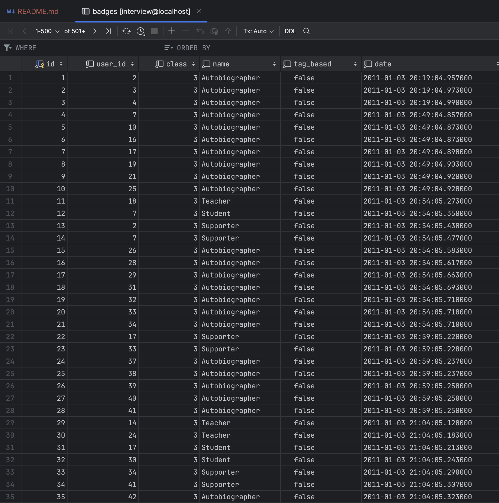
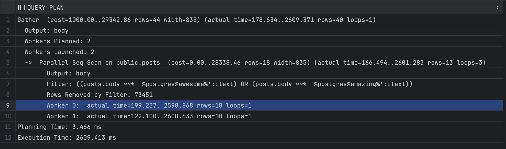
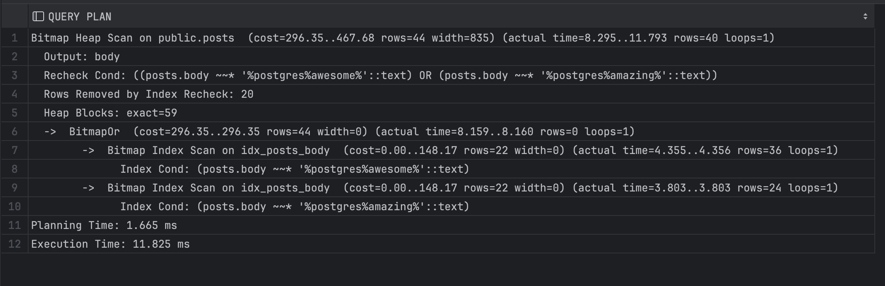

# Решение тестового задания на стажировку в компанию Postgres Professional

[Направления стажировок](https://pgstart.ru/)

[Ссылка на задание](https://gist.github.com/pkonotopov/951379a515ae4906faa9d09c0d927e10)

## Развертывание рабочего окружения

[Сcылка на задание](https://gist.github.com/pkonotopov/c1e048e217217dcb2e5d7bed1739b238)

Первое и самое простое задание. Копируем и выполняем в терминале команды:

```bash
git clone https://git.postgrespro.ru/p.konotopov/dba-interview.git dba-interview

cd ./dba-interview

docker compose up -d
```

После этого по адресу `http://localhost:13030` доступна вот такая страница:


После этого по заданию нужно было изучить схему БД, но по адресу, на который вела [ссылка](https://gist.github.com/pkonotopov/SCHEMA.md, страница не существует :(

В клонированном репозитории я обнаружил документ, похожий на то, что нужно было изучить: [вот он](https://github.com/pkonotopov/ndxg65cdMD2zudNrK4bNXtFuRkJ92V/blob/main/SCHEMA.md)

###

Подключаемся к базе данных на localhost на порту 15466, пользователь: postgres, пароль: postgres.

Порт указан в файле docker compose, а данные для подключения - в файле postgres.env

Видим вот такую картину:


Таблицы не пустые, например, вот так выглядит таблица badges:



После этого я решил, что на данный момент задание выполнено. Идем дальше

## Улучшить время выполнения следующего запроса:

```sql
explain analyze verbose
SELECT body 
  FROM posts 
 WHERE body ILIKE '%postgres%awesome%'
    OR body ILIKE '%postgres%amazing%';
```

Ранее мне не приходилось создавать индекс для текстовых полей. Первая ссылка в поиске гугл ведет на [страницу](https://www.postgresql.org/docs/current/textsearch-indexes.html) с документацией,
которая говорит что это можно сделать при помощи двух видов индексов:

```sql
CREATE INDEX name ON table USING GIN (column);
-- Creates a GIN (Generalized Inverted Index)-based index. The column must be of tsvector type.

CREATE INDEX name ON table USING GIST (column [ { DEFAULT | tsvector_ops } (siglen = number) ] );
-- Creates a GiST (Generalized Search Tree)-based index. The column can be of tsvector or tsquery type. Optional integer parameter siglen determines signature length in bytes (see below for details).
```

Какой же из двух индексов выбрать? Есть вот такая [информация](https://www.postgresql.org/docs/9.1/textsearch-indexes.html) 
из документации для версии postgres 9.1. Там говорится, что GIN индекс примерно в 3 раза быстрее при поиске информации,
но также в 3 раза медленнее при построении индекса. Также они занимают в 2-3 раза больше памяти. 
В документации для версии postgresql начиная с 9.5 и более новых эти строки отсутствуют.

В документации для версии 16 сказано, что скорость построения GIN индекса можно увеличить путем изменения параметра maintenance_work_mem,
который по умолчанию равен 64 Мб. Это объем оперативной памяти, который выделяется для служебных процессов, таких как
VACUUM, CREATE INDEX, а также ALTER TABLE ADD FOREIGN KEY. Одновременно может выполняться только один из них, 
поэтому можно достаточно смело выделить больше памяти.

В современных высоконагруженных и обьемных базах данных для удобства конечных пользователей я бы выбрал индекс GIN 
из-за его большей скорости поиска информации. Она достигается путем построения дополнительной структуры 
в виде B-дерево над указанным столбцом (полем) в таблице.

Создать индекс для требуемой таблицы можно при помощи вот такой пары запросов:

```sql
CREATE EXTENSION pg_trim;
CREATE INDEX idx_posts_body ON posts USING GIN (body gin_trgm_ops);
```

Теперь после добавления расширения pg_trim нам доступны несколько новых функций для поиска и сравнения строк.
Например, мы можем выполнять подобные запросы для сравнения строк:

```sql
SELECT word_similarity('word', 'words'), strict_word_similarity('word', 'words');
```
Получаем вот такой [результат](./img/word_similarity.png)

Результат выполнения запроса до создания индекса:



Создание индекса длилось около 50 секунд.

Результат выполнения запроса с индексом:



Как видим, Execution time уменьшился с 2600 миллисекунд до 12

## Представим себе, что данная БД находится под нагрузкой в продуктивном окружении. Если вам потребуется создать индекс, то как вы будете это делать?

Можно выполнить следующие действия:

* Проверить создание индекса на тестовом окружении

* Использовать время, запланированное на техобслуживание сервера, для создания индекса

* Есть возможность сделать процесс создания индекса параллельным в несколько потоков

## Является ли хорошей практикой создание индекса во время высокой транзакционной нагрузки?

Создание индекса при высокой нагрузке не является хорошей практикой, так как на время создания индекса
таблица получает блокировки на любые операции, которые изменяют данные(INSERT, UPDATE, DELETE).
Есть параметр [CONCURRENTLY](https://www.postgresql.org/docs/current/sql-createindex.html#SQL-CREATEINDEX-CONCURRENTLY), который позволяет выполнять создание индекса без блокировки, но он требует дополнительного времени и ресурсов компьютера 
для создание индекса. 

## Какие параметры PostgreSQL нужно изменить, чтобы ускорить создание индекса при повышенной нагрузке?

При настройке параметров PostgreSQL нужно учитывать имеющиеся ресурсы системы, и некоторые параметры выставлять в % от максимально доступных значений.

[Документация](https://www.postgresql.org/docs/current/sql-createindex.html#SQL-CREATEINDEX-CONCURRENTLY)

* `maintenance_work_mem`

    Есть рекомендация [вот тут], что этот параметр можно увеличить до 1/4 от доступного объема оперативной памяти.
    Можно и больше, если отдельно управлять процессом autovacuum, так как он может выполняться параллельно и каждый поток задействует maintenance_work_mem памяти.

* `max_worker_processes` 
   
  отвечает за максимальное количество фоновых процессов, которые можно запустить в системе. Увеличение этого параметра также нужно проводить осторожно,
  так как autovacuum, который тоже может проходить параллельно

* `max_parallel_workers`
  
    максимальное число процессов, которые система может поддерживать для параллельных операций. Не может быть больше чем `max_worker_processes`

* `max_parallel_maintenance_workers`

    отвечает за максимальное количество служебных процессов, которые может задействовать команда CREATE INDEX.
